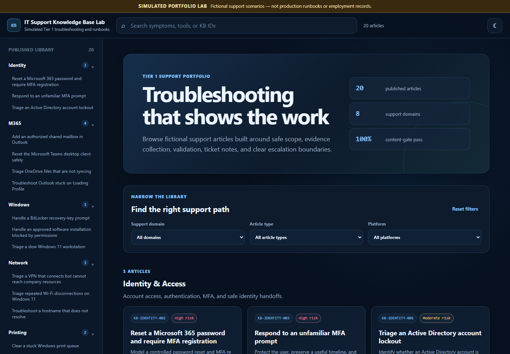
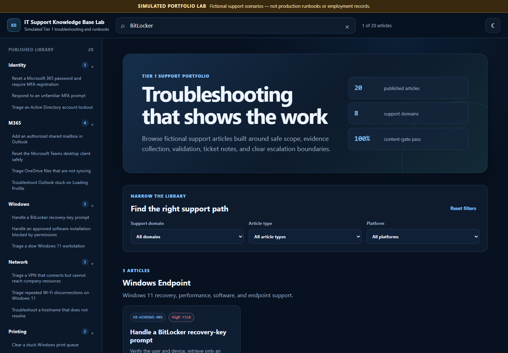
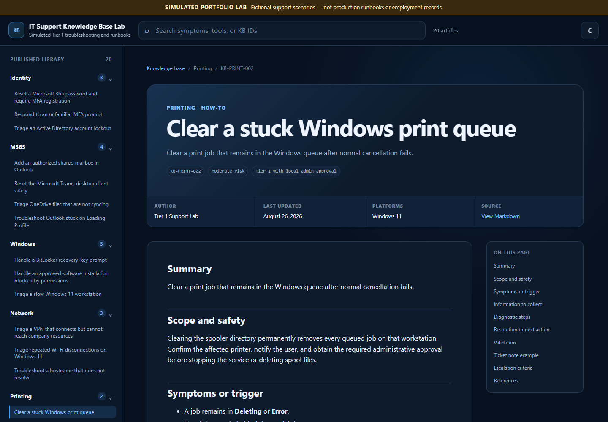
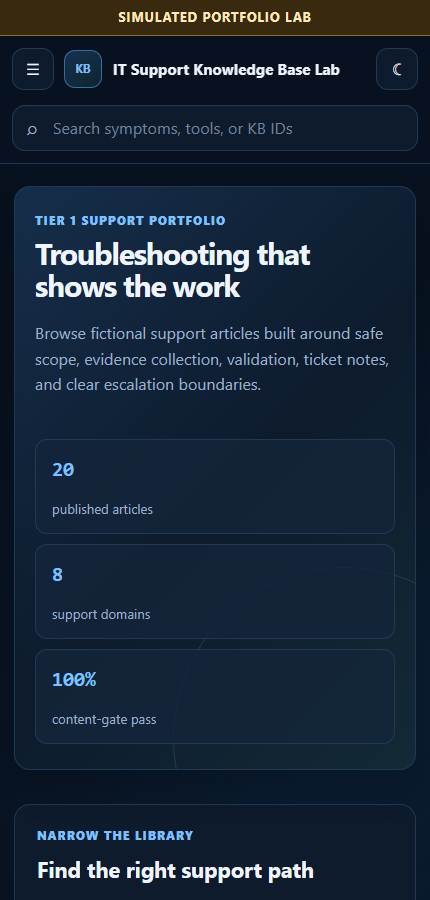

# IT Support Knowledge Base Lab

[](https://www.python.org/)
[](https://github.com/vxti-glitch/IT-Knowledge-Base/actions/workflows/ci.yml)
[](https://github.com/vxti-glitch/IT-Knowledge-Base/actions/workflows/pages.yml)
[](LICENSE)

[Open the live simulated knowledge base](https://vxti-glitch.github.io/IT-Knowledge-Base/) · [Take the 90-second tour](#90-second-tour) · [Browse the source articles](docs) · [Review the quality checks](tests/test_kb.py)

> **SIMULATED PORTFOLIO PROJECT:** The organizations, users, devices, incidents, and support procedures in this repository are fictional. The material demonstrates documentation and troubleshooting practices; it is not production documentation, an employment record, or a claim of live enterprise administration. Validate commands, permissions, and current vendor guidance before real-world use.

A searchable IT-support documentation lab built for remote Tier 1, help-desk, desktop-support, and technical-support portfolios. Thirty-eight focused articles are compiled from Markdown into a responsive static website, validated by automated content tests, and deployed through GitHub Actions.



## 90-second tour

1. [Open the live knowledge base](https://vxti-glitch.github.io/IT-Knowledge-Base/).
2. Search for `BitLocker`, `account lockout`, `print queue`, or `VPN`.
3. Filter the library by support domain, article type, platform, or audience.
4. Open an article and review its safety boundary, evidence collection, validation, ticket note, escalation criteria, and official references.
5. Copy the simulated ticket note, record browser-only article feedback, and follow the related-article suggestions.
6. Review the [automated tests](tests/test_kb.py) and [Pages deployment workflow](.github/workflows/pages.yml).

## What this project demonstrates

- Tier 1 troubleshooting that starts with scope and evidence
- Clear separation between technician actions and escalation boundaries
- User-facing communication and internal ticket-note examples
- Windows 11, Active Directory, Microsoft 365, Entra ID, networking, VPN, printing, onboarding, and security intake
- Searchable knowledge-base taxonomy and consistent metadata
- Article feedback, related-content suggestions, access labels, and one-click simulated ticket-note copying
- Python static-site generation with sanitized Markdown output
- Accessible navigation, responsive layout, and keyboard-friendly controls
- Automated content validation, local link checking, CI, and GitHub Pages deployment

## Published support domains

| Domain | Examples |
|---|---|
| Start Here | First-contact triage, symptom routing, command reference |
| Identity & Access | AD account lockouts, password/MFA reset, unfamiliar MFA prompts |
| Microsoft 365 | Outlook profiles, Teams reset, OneDrive sync, shared mailboxes |
| Windows Endpoint | BitLocker recovery, performance triage, software installation controls |
| Networking & VPN | Connected-without-access VPN, Wi-Fi drops, DNS resolution |
| Printing | Offline printer triage and stuck print queues |
| User Lifecycle | Controlled onboarding and offboarding |
| Security & Escalation | Phishing intake and lost-device response |
| Support Operations | Safe, clear remote-support sessions |
| Hardware & Peripherals | Displays, docks, audio, microphones, USB devices |
| Accessibility | Consent-centered assistive-technology support |

The published library intentionally favors 38 specific, interview-ready articles over a larger collection of repetitive or unverified material. Troubleshooting, how-to, checklist, quick-reference, concept, and security-response archetypes keep the structure appropriate to the task while preserving safety and validation standards.

## Screenshots

| Search and filters | Article view |
|---|---|
|  |  |



## Architecture

```text
IT-Knowledge-Base/
├── .github/
│   ├── assets/                    # Recruiter-facing screenshots
│   └── workflows/
│       ├── ci.yml                 # Validate, test, and build every change
│       └── pages.yml              # Deploy validated output to GitHub Pages
├── docs/                          # Published Markdown source
│   ├── start-here/
│   ├── accessibility/
│   ├── hardware-peripherals/
│   ├── identity-access/
│   ├── microsoft-365/
│   ├── networking-vpn/
│   ├── printing/
│   ├── security-escalation/
│   ├── support-operations/
│   ├── user-lifecycle/
│   └── windows-endpoint/
├── kb/
│   ├── static/                    # Reviewable CSS and JavaScript
│   ├── templates/                 # Autoescaped Jinja HTML templates
│   ├── builder.py                 # Static-site build and derived report
│   ├── cli.py                     # Build and validation commands
│   ├── config.py                  # Taxonomy and quality policy
│   ├── parser.py                  # Frontmatter, Markdown, and content validation
│   └── renderer.py                # Template rendering
├── tests/test_kb.py               # Parser, content, build, and link tests
├── AUTHORING_GUIDE.md             # Article schema and writing standard
├── requirements.txt
├── requirements-dev.txt
└── README.md
```

Generation flow:

1. `python -m kb check` validates every published article.
2. The parser normalizes metadata and rejects duplicate or placeholder content.
3. Markdown is rendered and sanitized before entering autoescaped templates.
4. The builder creates `index.html`, one page per article, local CSS/JavaScript, `search-index.json`, and `build-report.json`.
5. Tests verify content integrity, generated files, local links, the simulation boundary, and self-contained assets.
6. GitHub Pages deploys only after validation and tests pass.

## Run it on Windows

Run these commands from a normal PowerShell window, not from `C:\Windows\System32`:

```powershell
Set-Location "$env:USERPROFILE\Documents"
git clone https://github.com/vxti-glitch/IT-Knowledge-Base.git
Set-Location .\IT-Knowledge-Base

python -m venv .venv
.\.venv\Scripts\Activate.ps1
python -m pip install --upgrade pip
python -m pip install -r requirements.txt

python -m kb check
python -m unittest discover -s tests -v
python -m kb build --docs .\docs --output .\output
python -m http.server 8000 --directory .\output
```

Open [http://localhost:8000](http://localhost:8000) in a browser. Press `Ctrl+C` in PowerShell when finished.

If PowerShell blocks virtual-environment activation, the project can still run through the environment's Python executable:

```powershell
.\.venv\Scripts\python.exe -m pip install -r requirements.txt
.\.venv\Scripts\python.exe -m kb check
.\.venv\Scripts\python.exe -m kb build --docs .\docs --output .\output
.\.venv\Scripts\python.exe -m http.server 8000 --directory .\output
```

## Content quality gate

A published article must have:

- A unique `KB-DOMAIN-###` identifier
- A supported domain, article type, risk level, and matching folder
- ISO `last_updated` date, author, support tier, tags, and platforms
- Summary, scope and safety, symptoms, information to collect, diagnostics, next action, validation, ticket note, escalation criteria, and references
- At least two normalized tags
- No duplicate body, copied permalink marker, or known placeholder phrase

The build fails before deployment when any requirement is violated. See [AUTHORING_GUIDE.md](AUTHORING_GUIDE.md) for the exact schema.

## Commands

```powershell
# Validate published content without building
python -m kb check --docs .\docs

# Run automated tests
python -m unittest discover -s tests -v

# Build the static site
python -m kb build --docs .\docs --output .\output

# Preview the generated site
python -m http.server 8000 --directory .\output
```

## Generated artifacts

The ignored `output/` directory contains:

```text
output/
├── assets/
│   ├── site.css
│   └── site.js
├── index.html
├── <article-slug>.html
├── search-index.json
└── build-report.json
```

`build-report.json` contains derived portfolio facts such as article counts and quality-gate status. It does not contain production KPIs or employment results.

## Deployment

[`.github/workflows/pages.yml`](.github/workflows/pages.yml) runs on pushes to `main` and manual dispatch. It installs dependencies, validates content, runs tests, builds the complete site, and deploys `output/` through the official GitHub Pages actions.

GitHub Pages should remain configured with:

- **Source:** GitHub Actions
- **Website:** `https://vxti-glitch.github.io/IT-Knowledge-Base/`
- **HTTPS:** Enforced

## Honest interview discussion

Useful points to explain:

- Why quality and specificity matter more than article count
- How the content gate prevents duplicate IDs and generic templates
- Why the live site visibly labels every scenario as simulated
- How the search index, filters, and query-string search work
- Why commands include scope, approval, validation, and escalation guidance
- How CI prevents invalid documentation from reaching GitHub Pages

Limitations to disclose:

- The scenarios and support data are fictional.
- No live tenant, domain, production queue, or employer system is represented.
- Commands were not executed against a production environment.
- Vendor instructions and organizational policy must be revalidated before operational use.

## License

Code and original documentation in this repository are available under the [MIT License](LICENSE). External references remain subject to their publishers' terms.
